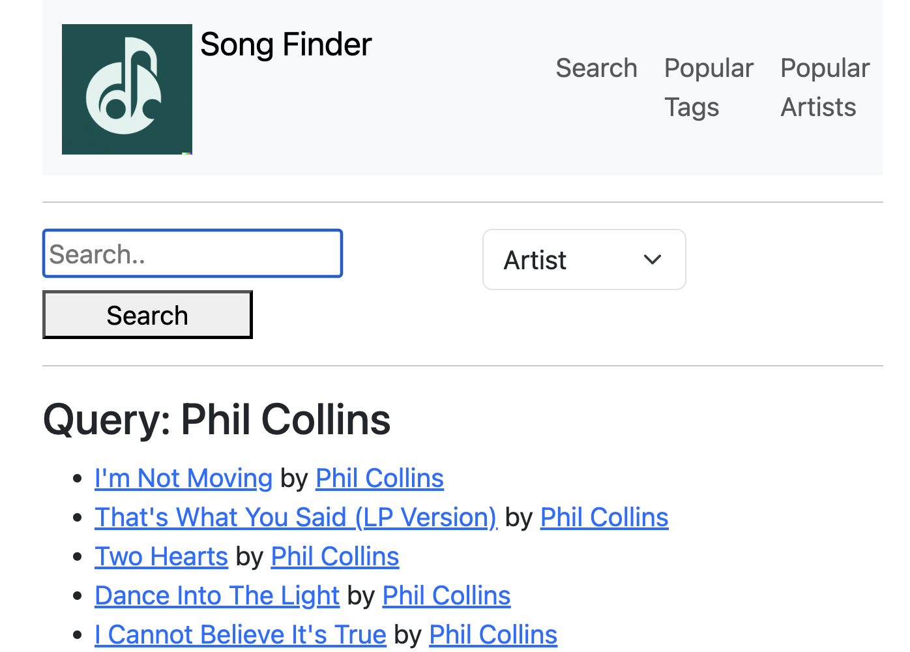

# Song Finder - Part 2 - Project 6
### Due Thursday, December 12, 2024

### Overview
For this assignment, you will extend your Project 5 solution to provide a web-based user interface. You have 25 points of minimally required functionality; 10 points of design/grading requirements; and 15 points of additional functionality. You will determine which features you wish to implement to earn the additional functionality points. I provide a list of some options, and I am open to other options you propose. You are strongly advised to discuss with me any options that do not appear on the list below before beginning work. I make no guarantee about how many points a feature will be worth unless we have discussed via Teams or during office hour.

### Minimum Requirements [25 points]
At minimum, your interface must support the following the following operations:

1. [10 points] Search by artist
2. [10 points] Search by tag
3. [5 points] Show popular tags

Below is an example of a very simple interface you might use to support these operations. Note that the Popular tags list is dynamic and may change (i.e., if tags are added).

### Additional Requirements [25 points]

Your grade will also be based up on the following:

1. [5 points] Your main function will be in a file `server.py`. The program will
   expect a command line parameter specifying the location of the top-level
   lastfm_subset directory, i.e., the program will be run as follows: flask
  --app server run <directory_name>
2. [5 points] Code design: You are expected to produce well designed and
   well-documented code.
3. [5 points] You must modify the README.md document in your repository to describe the
   features you have implemented. 
4. [20 points] Additional features: You may earn up to 25 points for implementing additional features. **Yes, if you implement 25 points worth of additional features you may earn up to 10 points of extra credit on this assignment.** Following is a list of a few possible additional features. You may implement features not on this list, but you are **strongly** advised to confirm the number of points a feature will be worth before beginning work.
  - [5 points] View song info: Make the title of a song a clickable link. When the user follows the link, show the information for the song.
  - [5 points] Add a new song: Provide the ability for a user to enter information about a new song and add that song to the library.
  - [5 points] Add a tag: Allow the user to add a tag to a song. It is advised that this feature be implemented alongside view song info so that you can easily tag the song on the page that displays the song information.
  - [5 - 10 points] Improved user interface: Implement a "fancy" user interface. 
  - [10 points] Similar songs: Update your data structure(s) to maintain the similar song information available in the JSON data set. Allow the user to view songs that are similar to a given song.

## Assignment Submission

To earn credit for this assignment you must commit all of your changes to your GitHub repository prior to the deadline. It is strongly recommended that you commit your changes regularly. Do not wait until you complete all four parts of the assignment to upload your (partial) solution.

Step 1 - *Stage Changes*: Select the Source Control icon in the VSCode left menu. In the Changes section, click the + to *Stage All Changes*.

Step 2 - Commit Message: In the text box that says Message enter a meaningful message that describes the change you just completed.

Step 3 - *Commit & Push*: Select the down arrow in the blue box that says Commit. Choose *Commit & Push*.

Step 4 - Verify: Visit the repository on GitHub to confirm that your changes were uploaded successfully.